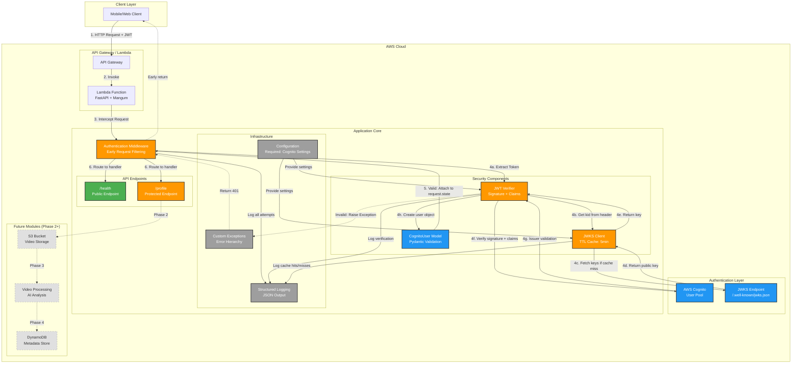

# Sentinel-V: Serverless Video Processing Pipeline


[]()
[]()
[]()
[]()
[]()

Production-grade serverless video processing pipeline with AWS Cognito authentication, designed for AWS Lambda deployment.

## 🏗️ High-Level Architecture



## 📋 Table of Contents

- [Features](#-features)
- [Architecture Details](#-architecture-details)
- [Project Structure](#-project-structure)
- [Getting Started](#-getting-started)
- [Configuration](#-configuration)
- [Testing](#-testing)
- [API Documentation](#-api-documentation)
- [Security](#-security)
- [Deployment](#-deployment)

## ✨ Features

### Phase 1: Production-Grade Security (COMPLETE ✅)

- **AWS Cognito Integration**: Real JWT verification with JWKS
- **Middleware-Based Authentication**: Early request filtering before routing
- **Comprehensive Testing**: 35 tests with 89% code coverage
- **Structured Logging**: JSON output for CloudWatch/ELK integration
- **Type Safety**: Full Pydantic validation and type hints
- **Error Handling**: Custom exception hierarchy with specific error messages
- **Performance**: JWKS caching reduces latency (TTL: 5 minutes)

### Future Phases (Planned)

- **Phase 2**: S3 integration with presigned URLs
- **Phase 3**: Video processing trigger on upload
- **Phase 4**: AI analysis and JSON report generation

## 🔧 Architecture Details

### Security Flow

```
1. Client Request → API Gateway → Lambda
2. Lambda → AuthenticationMiddleware (intercepts ALL requests)
3. Middleware extracts Bearer token from Authorization header
4. JWT Verifier:
   a. Decodes header to get 'kid' (key ID)
   b. Fetches public key from JWKS cache (or Cognito if cache miss)
   c. Verifies RSA signature
   d. Validates claims (issuer, audience, expiration, required fields)
5. If valid:
   - Creates CognitoUser object
   - Attaches to request.state
   - Continues to route handler
6. If invalid:
   - Returns 401 immediately (no handler execution)
   - Logs failure reason
```

### Component Responsibilities

| Component | Responsibility | Key Features |
|-----------|----------------|--------------|
| **AuthenticationMiddleware** | Early request filtering | Public path bypass, 401 before routing |
| **JWKSClient** | Manage signing keys | TTL cache, thread-safe, error handling |
| **JWT Verifier** | Token validation | Signature + claims validation |
| **CognitoUser Model** | User representation | Pydantic validation, type safety |
| **Structured Logging** | Observability | JSON output, contextual info |

## 📁 Project Structure

```
sentinel-v/
├── app/
│   ├── __init__.py
│   ├── main.py                    # FastAPI app + Lambda handler
│   ├── api/
│   │   └── v1/
│   │       ├── api.py             # Router aggregation
│   │       └── endpoints/
│   │           ├── health.py      # Public endpoint
│   │           └── profile.py     # Protected endpoint
│   ├── core/
│   │   ├── config.py              # Settings with Cognito config
│   │   ├── exceptions.py          # Custom exception hierarchy
│   │   ├── jwks.py                # JWKS client with caching
│   │   ├── security.py            # JWT verification + User model
│   │   └── logging.py             # Structured logging setup
│   └── middleware/
│       └── auth_middleware.py     # Authentication middleware
├── tests/
│   ├── conftest.py                # Fixtures (RSA keys, tokens)
│   ├── unit/
│   │   ├── test_jwks.py           # JWKS client tests (6)
│   │   └── test_security.py       # JWT verification tests (9)
│   ├── integration/
│   │   ├── test_auth_flow.py      # End-to-end auth tests (8)
│   │   └── test_middleware.py     # Middleware tests (5)
│   └── api/v1/
│       ├── test_health.py         # Health endpoint tests (3)
│       └── test_profile.py        # Profile endpoint tests (4)
├── .env.example                   # Environment template
├── pyproject.toml                 # Dependencies + config
└── README.md                      # This file
```

## 🚀 Getting Started

### Prerequisites

- Python 3.13+
- [uv](https://github.com/astral-sh/uv) package manager
- AWS Cognito User Pool (for production)

### Installation

1. **Clone the repository**:
   ```bash
   git clone <repository-url>
   cd sentinel-v
   ```

2. **Install dependencies**:
   ```bash
   uv sync
   ```

3. **Configure environment**:
   ```bash
   cp .env.example .env
   # Edit .env with your Cognito details
   ```

4. **Run tests** (optional):
   ```bash
   uv run pytest --cov=app
   ```

5. **Start development server**:
   ```bash
   uv run uvicorn app.main:app --reload
   ```

## ⚙️ Configuration

### Required Environment Variables

```bash
# AWS Cognito Configuration
COGNITO_REGION=us-east-1                    # AWS region
COGNITO_USER_POOL_ID=us-east-1_XXXXXXXXX    # User Pool ID
COGNITO_APP_CLIENT_ID=your-client-id        # App Client ID

# Optional Configuration
JWKS_CACHE_TTL=300                          # JWKS cache TTL (seconds)
LOG_LEVEL=INFO                              # Logging level
TESTING_MODE=false                          # Enable test mode
```

```bash
cp .env.example .env
# Edit .env with your Cognito details
```

### Configuration Validation

The application validates required environment variables on startup and fails fast if configuration is incomplete.

## 🧪 Testing

### Run All Tests

```bash
# Run with coverage report
uv run pytest --cov=app --cov-report=term-missing --cov-report=html -v

# View HTML coverage report
open htmlcov/index.html
```

### Test Categories

| Category | Tests | Coverage | Description |
|----------|-------|----------|-------------|
| **Unit Tests** | 15 | 100% | JWKS client + JWT verification |
| **Integration Tests** | 13 | 89% | Auth flow + middleware behavior |
| **API Tests** | 7 | 100% | Endpoint functionality |
| **Total** | **35** | **89%** | Full test suite |

### Test Fixtures

The test suite includes comprehensive fixtures:
- RSA key pair generation for token signing
- Valid/expired/invalid token creation
- Mock JWKS client with configurable responses
- Time-based testing with `freezegun`

## 📚 API Documentation

### Interactive Docs

Once the server is running, visit:
- **Swagger UI**: http://localhost:8000/docs
- **ReDoc**: http://localhost:8000/redoc

### Endpoints

#### Public Endpoints

**GET /** - Root endpoint
```bash
curl http://localhost:8000/
```
Response:
```json
{
  "message": "Sentinel-V API is running",
  "version": "1.0.0",
  "docs": "/docs"
}
```

**GET /api/v1/health** - Health check
```bash
curl http://localhost:8000/api/v1/health
```
Response:
```json
{
  "status": "ok",
  "project": "Sentinel-V",
  "region": "us-east-1"
}
```

#### Protected Endpoints

**GET /api/v1/profile** - Get current user profile
```bash
curl -H "Authorization: Bearer <jwt-token>" \
     http://localhost:8000/api/v1/profile
```
Response:
```json
{
  "username": "john.doe",
  "sub": "uuid-1234-5678",
  "email": "john@example.com",
  "email_verified": true,
  "groups": ["users", "admins"],
  "token_use": "id"
}
```

### Error Responses

**401 Unauthorized** - Missing or invalid token
```json
{
  "detail": "Not authenticated"
}
```

**401 Unauthorized** - Expired token
```json
{
  "detail": "Token has expired"
}
```

**503 Service Unavailable** - JWKS fetch failure
```json
{
  "detail": "Authentication service temporarily unavailable"
}
```

## 🔒 Security

### Authentication Flow

1. **Token Extraction**: Middleware extracts JWT from `Authorization: Bearer <token>` header
2. **Signature Verification**: RSA signature verified using Cognito's public keys (JWKS)
3. **Claims Validation**:
   - Issuer matches Cognito User Pool
   - Audience matches App Client ID
   - Token not expired (`exp` claim)
   - Required claims present (`sub`, `username`)
4. **User Object Creation**: Validated claims mapped to `CognitoUser` Pydantic model
5. **Request Attachment**: User object attached to `request.state` for handlers

### Security Features

✅ **No Mock Bypasses**: All tokens must pass full signature verification  
✅ **Early Filtering**: Middleware blocks unauthorized requests before routing  
✅ **JWKS Caching**: Reduces latency while maintaining security  
✅ **Comprehensive Logging**: All auth attempts logged for audit  
✅ **Custom Exceptions**: Specific error messages without leaking sensitive info  
✅ **Type Safety**: Pydantic validation prevents injection attacks

### Security Testing

The test suite includes:
- Signature tampering detection
- Expired token rejection
- Wrong issuer/audience detection
- Missing claims validation
- Malformed token handling

## 🚢 Deployment

### Docker Deployment

#### Build and Run Locally

```bash
# Build Docker image
docker build -t sentinel-v:latest .

# Run container
docker run -p 8000:8000 \
  -e COGNITO_REGION=us-east-1 \
  -e COGNITO_USER_POOL_ID=us-east-1_XXXXXXXXX \
  -e COGNITO_APP_CLIENT_ID=your-client-id \
  sentinel-v:latest

# Or use docker-compose
docker-compose up -d
```

#### Docker Image Details

- Base: `python:3.13-slim`
- Package  Manager: `uv`
- Size: ~200MB (optimized)
- Health check: `/api/v1/health`
- Exposed port: 8000

### CI/CD Pipeline

The project includes GitHub Actions workflows for automated testing and deployment:

#### CI Workflow (`.github/workflows/ci.yml`)

Triggers on push to `main`/`develop` branches and pull requests:

1. **Test Job**:
   - Runs full test suite with coverage
   - Uploads coverage to Codecov
   - Updates README badges automatically
   
2. **Lint Job**:
   - Code formatting check (black)
   - Type checking (mypy)
   
3. **Docker Job**:
   - Builds Docker image
   - Tests image functionality

#### Badge Updates (`.github/workflows/update-badges.yml`)

Automatically updates README badges after successful CI runs:
- Coverage percentage with color coding
- Test count
- Commits changes back to main branch

#### Setting Up CI/CD

1. **Enable GitHub Actions** in your repository
2. **Set repository secrets** (if using Codecov):
   ```
   CODECOV_TOKEN=your-codecov-token
   ```
3. **Update badge URLs** in README.md:
   ```markdown
   
   ```

### AWS Lambda Deployment

1. **Package the application**:
   ```bash
   # Install dependencies
   uv sync --frozen
   
   # Package for Lambda
   cd .venv/lib/python3.13/site-packages
   zip -r ../../../../function.zip .
   cd ../../../../
   zip -g function.zip -r app/
   ```

2. **Deploy to Lambda**:
   - Upload `function.zip` to AWS Lambda
   - Set handler to `app.main.handler`
   - Configure environment variables
   - Set timeout to 30 seconds (recommended)
   - Memory: 512 MB minimum

3. **Configure API Gateway**:
   - Create REST API or HTTP API
   - Configure Lambda proxy integration
   - Deploy to stage

### Environment Variables (Lambda)

Set the following in Lambda configuration:
```
COGNITO_REGION=us-east-1
COGNITO_USER_POOL_ID=us-east-1_XXXXXXXXX
COGNITO_APP_CLIENT_ID=your-client-id
JWKS_CACHE_TTL=300
LOG_LEVEL=INFO
```

## 📊 Performance

### Metrics

| Metric | Value | Notes |
|--------|-------|-------|
| Cold Start | ~1-2s | First request after idle |
| Warm Request | <50ms | Cached JWKS |
| JWKS Cache Hit | ~5ms | No external call |
| JWKS Cache Miss | ~200ms | Fetches from Cognito |
| Test Execution | 0.22s | 35 tests |

### Optimization

- **JWKS Caching**: 5-minute TTL reduces Cognito API calls
- **Middleware Early Exit**: Unauthorized requests never reach handlers
- **Pydantic Validation**: Fast runtime validation with minimal overhead

## 🛠️ Development

### Code Quality

- **Type Hints**: All functions have type annotations
- **Docstrings**: Key functions documented
- **Error Handling**: Comprehensive try/except with specific exceptions
- **Logging**: Structured logging for all critical paths

### Running Locally

```bash
# Development mode with auto-reload
uv run uvicorn app.main:app --reload --port 8000

# With custom log level
LOG_LEVEL=DEBUG uv run uvicorn app.main:app --reload
```

## 📝 License

This project is licensed under the MIT License.

## 🤝 Contributing

Contributions welcome! Please:
1. Fork the repository
2. Create a feature branch
3. Add tests for new functionality
4. Ensure all tests pass (`uv run pytest`)
5. Submit a pull request

## 📞 Support

For issues or questions, please open an issue on GitHub.

---

**Built with ❤️ using FastAPI, AWS Cognito, and modern Python best practices.**
